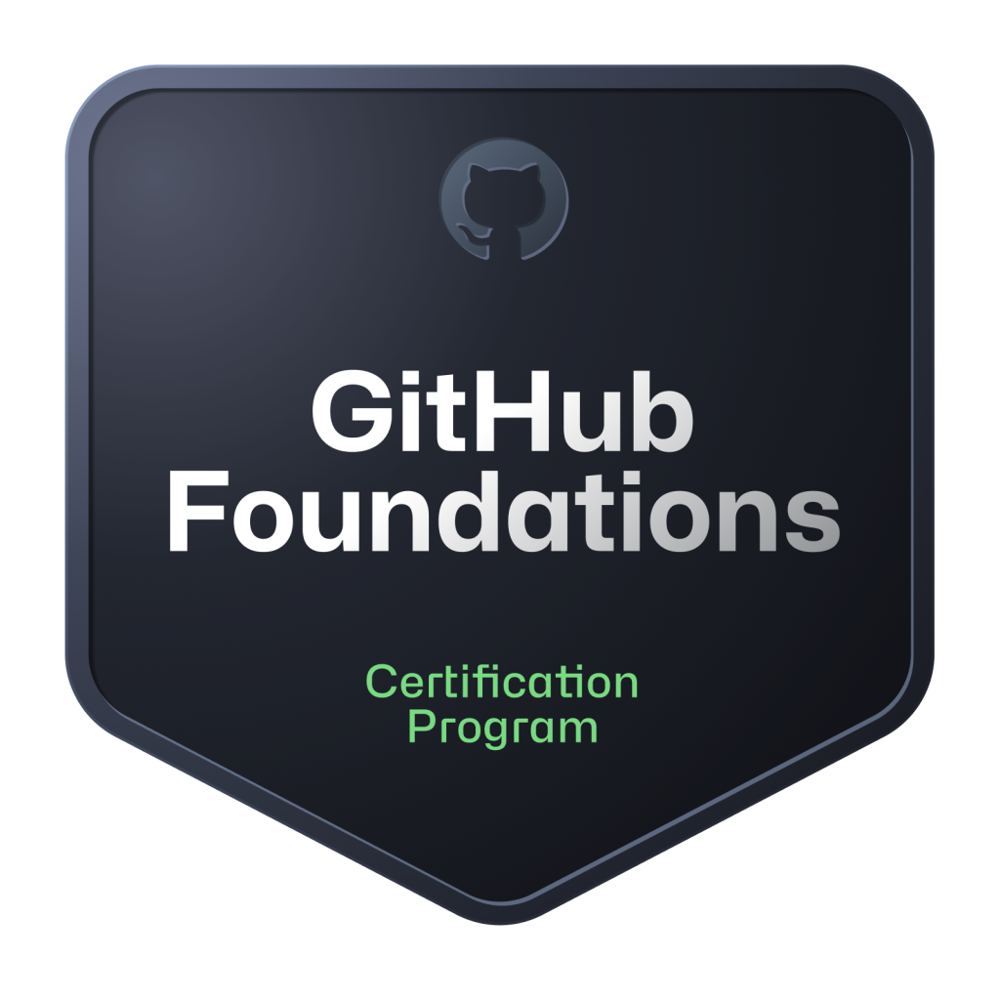

# 🐙 Formação Github Certification

  
  Este repositório corresponde ao compliado de conteúdos utilizados na [Formação Github Certification](https://web.dio.me/track/formacao-github-certification). Aqui você irá encontrar meus desafios, projetos, recursos e links úteis utilizados para concluir a formação.
  

### 🗂️ O que você encontrará aqui?
Este repositório está organizado para armazenar e gerenciar todos os materiais do bootcamp e da formação, assim como os desafios, links úteis, estudos e outros recursos.

- 🔍 [Recursos de Estudo:](https://github.com/rhayssakramer/formacao-github-certification?tab=readme-ov-file#-recursos-de-estudo) links e materiais recomendados para o estudo da Certificação da GitHub Foundations.
- 💻 [Projetos e Desafios:](https://github.com/rhayssakramer/formacao-github-certification?tab=readme-ov-file#-projetos-e-desafios) códigos e exercícios práticos realizados durante a formação.
- 🔗 [Links Úteis:](https://github.com/rhayssakramer/formacao-github-certification?tab=readme-ov-file#-links-%C3%BAteis) links, artigos e documentação oficial (Material de grande importância para o exame GitHub Foundations).

### 🔍 Recursos de Estudo
Aqui você encontrará uma lista de recursos úteis para se preparar para o exame:
- [Coleção do GitHub Foundations no Microsoft Learn](https://learn.microsoft.com/en-us/collections/o1njfe825p602p)
- [Coleção do GitHub Foundations no LinkedIn Learning](https://www.linkedin.com/learning/paths/prepare-for-the-github-foundations-certification)

### 💻 Projetos e Desafios  
Veja os projetos e desafios que completei durante a formação:
- [Desafios de Código]()
- [Desafio 1: Explorando Colaboração e Markdown](https://github.com/rhayssakramer/formacao-github-certification/tree/main/Desafio%2301-Explorando-Colabora%C3%A7%C3%A3o-Markdown)
- [Desafio 2: Utilizando as Ferramentas do Github para Solucionar Algoritmos em Python](https://github.com/rhayssakramer/formacao-github-certification/tree/main/Desafio%2302-Utilizando-GitHub-Copilot)
- [Desafio 3: Utilizando Recursos do Github em um Projeto Open Source](https://github.com/rhayssakramer/formacao-github-certification/tree/main/Desafio%2303-Utilizando-Recursos-em-Projeto-Open-Source)

### 🔗 Links Úteis
- [Página oficial de inscrição para o exame](https://examregistration.github.com/overview)
- [Documentação do GitHub](https://docs.github.com/)
- [Documentação GitHub Certification](https://docs.github.com/en/get-started/showcase-your-expertise-with-github-certifications)
- [Sobre GitHub Certification](https://docs.github.com/en/get-started/showcase-your-expertise-with-github-certifications/about-github-certifications)
- [Site GitHub Education](https://education.github.com/experiences/foundations_certificate)
- [Microsoft Learn for GitHub](https://learn.microsoft.com/en-us/training/github/)
- [Formação Github Certification](https://web.dio.me/track/formacao-github-certification)
- [Manual do Candidato](https://examregistration.github.com/handbook)
- [Perguntas Frequentes](https://examregistration.github.com/faq)
- [Artigo sobre Certificações do GitHub do Datacamp](https://www.datacamp.com/pt/blog/GitHub-certifications)

## ▶️ Conclusão
Este guia serve como repositório de estudos, desafios e projetos da [Formação Github Certification](https://web.dio.me/track/formacao-github-certification). Explore os recursos compartilhados necessários para atender às suas necessidades de GitHub.

## 🔗 Créditos
Este repositório foi desenvolvido como guia de estudos da Formação Github Certification, para avaliar o ensinado na formação sobre GitHub com finalidade de obter Certificação GitHub Foundations.

*Nota: Este projeto é apenas para fins educacionais e não possui nenhuma afiliação oficial com a franquia DIO ou suas empresas associadas.*

## 👩🏼‍💻 Autora:
<table style="border=0">
  <tr>
    <td align="left">
      <a href="https://github.com/rhayssakramer">
        <b>Rhayssa Kramer</b>
      </a>
       
      Sr. Assoc, Full-Stack Development
    </td>
  </tr>
</table>

